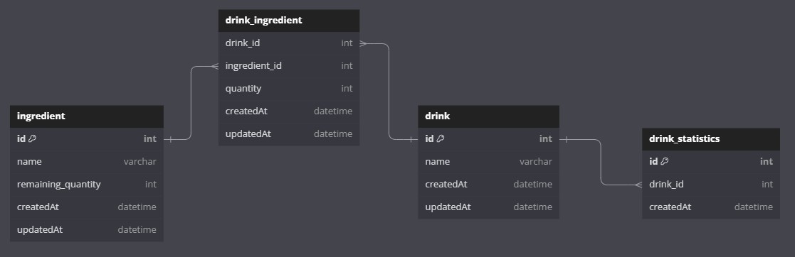

# Coffee Machine API

## Overview
This project is a software solution designed to control a coffee machine via API. The application allows users to add drink recipes and ingredients, monitor ingredient levels and collect statistics on drink consumption.

## Functional Requirements
- **Drink Preparation**:
    - Espresso
    - Americano
    - Cappuccino
    - Any other drinks

- **Ingredient Management**:
    - Monitor the quantity and availability of ingredients.

- **Recipe Management**:
    - Ability to save new drink recipes.

- **Statistics Collection**:
    - Track and identify the most popular drink based on user orders.

## Technology Stack
- Java (version 17)
-  Spring Framework / Spring Boot
-  Maven
-  PostgreSQL
-  Flyway
-  Swagger UI

Database Structure: https://dbdiagram.io/d/coffe_machine_db-66ec6300a0828f8aa66b7cd0

   
